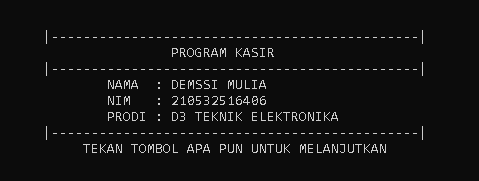
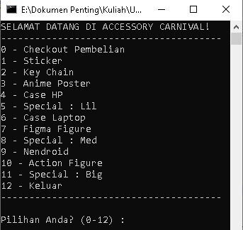
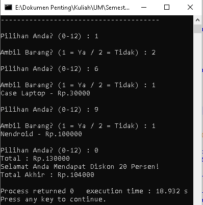
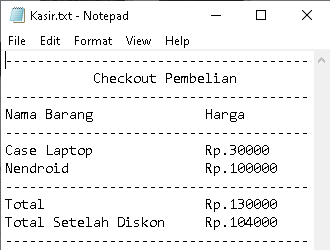

# Program Kasir Sederhana C++

Repositori ini berisi kode sumber untuk program kasir sederhana yang dibuat menggunakan bahasa pemrograman C++. Proyek ini awalnya dikembangkan sebagai tugas akhir untuk matakuliah Praktikum Dasar Pemrograman Komputer di Universitas Negeri Malang (Semester 2, Prodi D3 Teknik Elektronika, Tahun 2022).

## Tujuan Proyek

* Memenuhi persyaratan tugas akhir matakuliah Praktikum Dasar Pemrograman Komputer.
* Mendemonstrasikan pemahaman dan implementasi konsep-konsep dasar pemrograman C++, meliputi:
    * Tipe data dan variabel
    * Operator aritmatika dan logika
    * Struktur kontrol (kondisi `if-else if-else`)
    * Struktur perulangan (`for`, `do-while`)
    * Array (satu dan dua dimensi)
    * Fungsi (deklarasi, definisi, pemanggilan, *return value*)
    * Operasi file dasar (`fopen`, `fprintf`, `fclose`)
    * Input/Output standar (`printf`, `scanf`)
    * Penggunaan *library* standar (`stdio.h`, `stdlib.h`)

## Fitur Program

* **Menu Barang:** Menampilkan daftar barang beserta harganya yang tersimpan dalam *array*.
* **Pemilihan Barang:** Pengguna dapat memilih barang yang ingin dibeli berdasarkan nomor urut.
* **Konfirmasi Pembelian:** Pengguna diminta konfirmasi untuk setiap barang yang dipilih.
* **Perhitungan Total Belanja:** Akumulasi total harga barang yang dipilih.
* **Sistem Diskon Bertingkat:** Memberikan diskon berdasarkan total belanja:
    * [cite_start]20% untuk total > Rp 50.000 dan < Rp 200.000 [cite: 29-35]
    * [cite_start]40% untuk total >= Rp 200.000 dan < Rp 500.000 [cite: 36-42]
    * [cite_start]60% untuk total >= Rp 500.000 [cite: 43-48]
* **Checkout:** Menampilkan total belanja sebelum dan sesudah diskon.
* [cite_start]**Output ke File:** Menyimpan struk pembelian (daftar barang, total, total setelah diskon) ke dalam file teks bernama `Kasir.txt` [cite: 59, 102-108, 317, 319].
* **Opsi Keluar:** Memberikan pilihan untuk keluar dari program.

## Teknologi yang Digunakan

* **Bahasa Pemrograman:** C++
* **Library Standar C:**
    * `stdio.h` (Standard Input/Output)
    * `stdlib.h` (Standard Library, untuk `system("cls")`)
    * `conio.h` (Console Input/Output, untuk `getch()`) - *Catatan: Mungkin tidak tersedia di semua compiler.*

## Cara Kompilasi dan Menjalankan

1.  **Pastikan Anda memiliki C++ Compiler:** Anda memerlukan compiler C++ seperti GCC (MinGW untuk Windows) atau Clang.
2.  **Simpan Kode:** Simpan kode sumber di atas sebagai file bernama `program_kasir.cpp`.
3.  **Buka Terminal/Command Prompt:** Arahkan ke direktori tempat Anda menyimpan file.
4.  **Kompilasi Kode:** Jalankan perintah berikut (contoh menggunakan g++):
    ```bash
    g++ program_kasir.cpp -o program_kasir.exe
    ```
5.  **Jalankan Program:** Jalankan file hasil kompilasi:
    ```bash
    ./program_kasir.exe
    ```
    *(atau `program_kasir.exe` saja di Windows Command Prompt)*
6.  **Output File:** Setelah Anda melakukan *checkout* (memilih opsi 0), program akan membuat/menimpa file `Kasir.txt` di direktori yang sama, berisi struk pembelian Anda[cite: 59, 301].

## Struktur File

```
.
├── program_kasir.cpp   # File kode sumber C++
└── Kasir.txt           # File output struk (dihasilkan setelah program dijalankan)
```

## Contoh Output

*(Anda bisa menyertakan screenshot dari file 0.PNG, 1.PNG, 2.PNG, dan 4.PNG di sini untuk visualisasi)*

**Tampilan Awal:**
 **Menu Utama:**
 **Proses Pembelian & Checkout:**
 **Isi File Kasir.txt:**
 ## Analisis Singkat Kode (dari Laporan Asli)

[cite_start]Program ini menggunakan dua fungsi utama: `diskon()` untuk menghitung potongan harga berdasarkan total belanja, dan `main()` sebagai fungsi utama yang mengelola alur program[cite: 291]. [cite_start]Data barang dan harga disimpan dalam *array* `barang` dan `bayar`[cite: 294]. Program berinteraksi dengan pengguna melalui menu berbasis teks dan input `scanf`. Logika pemilihan barang, akumulasi total, dan penerapan diskon diatur menggunakan struktur `if-else if` dan loop `do-while`. [cite_start]Hasil akhir transaksi dicatat ke dalam file eksternal `Kasir.txt` menggunakan fungsi-fungsi dari `stdio.h` [cite: 299-319].

---
