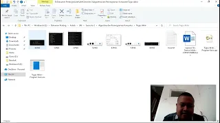

<div align="center">

# Program Kasir Sederhana C++

</div>

Repositori ini berisi kode sumber untuk program kasir sederhana yang dibuat menggunakan bahasa pemrograman C++. Proyek ini awalnya dikembangkan sebagai tugas akhir untuk matakuliah Praktikum Dasar Pemrograman Komputer di Universitas Negeri Malang (Semester 2, Prodi D3 Teknik Elektronika, Tahun 2022).

---

<div align="center">

## Tujuan Proyek

</div>

* Memenuhi persyaratan tugas akhir matakuliah Praktikum Dasar Pemrograman Komputer.
* Mendemonstrasikan pemahaman dan implementasi konsep dasar pemrograman C++, meliputi:
    * Tipe data dan variabel
    * Operator aritmatika dan logika
    * Struktur kontrol (kondisi `if-else if-else`)
    * Struktur perulangan (`for`, `do-while`)
    * Array (satu dimensi)
    * Fungsi (deklarasi, definisi, pemanggilan, `return value`)
    * Operasi file dasar (`fopen`, `fprintf`, `fclose`)
    * Input/Output standar (`printf`, `scanf`)
    * Penggunaan *library* standar (`stdio.h`, `stdlib.h`, `conio.h`)

---

<div align="center">

## Fitur Program

</div>

* **Menu Barang:** Menampilkan daftar barang beserta harganya yang tersimpan dalam *array*.
* **Pemilihan Barang:** Pengguna dapat memilih barang berdasarkan nomor urut.
* **Konfirmasi Pembelian:** Meminta konfirmasi (`Ya/Tidak`) sebelum menambahkan barang ke keranjang.
* **Perhitungan Total Belanja:** Mengakumulasi total harga barang yang dipilih.
* **Sistem Diskon Bertingkat:** Memberikan diskon otomatis berdasarkan total belanja:
    * 20% untuk total > Rp 50.000 dan < Rp 200.000
    * 40% untuk total >= Rp 200.000 dan < Rp 500.000
    * 60% untuk total >= Rp 500.000
* **Checkout:** Menampilkan total belanja sebelum dan sesudah diskon.
* **Output ke File:** Menyimpan struk pembelian (daftar barang, total, total setelah diskon) ke dalam file teks `Kasir.txt`.
* **Opsi Keluar:** Memungkinkan pengguna keluar dari program.

---

<div align="center">

## Teknologi yang Digunakan

</div>

* **Bahasa Pemrograman:** C++
* **Library Standar C:**
    * `stdio.h` (Standard Input/Output)
    * `stdlib.h` (Standard Library, untuk `system("cls")`)
    * `conio.h` (Console Input/Output, untuk `getch()`) - *Catatan: Mungkin tidak tersedia di semua compiler.*

---

<div align="center">

## Cara Kompilasi dan Menjalankan

</div>

1.  **Pastikan Anda memiliki C++ Compiler:** Seperti GCC (MinGW untuk Windows) atau Clang.
2.  **Simpan Kode:** Simpan kode sumber sebagai file bernama `program_kasir.cpp`.
3.  **Buka Terminal/Command Prompt:** Arahkan ke direktori tempat Anda menyimpan file.
4.  **Kompilasi Kode:** (Contoh menggunakan g++)
    ```bash
    g++ program_kasir.cpp -o program_kasir.exe
    ```
5.  **Jalankan Program:**
    ```bash
    ./program_kasir.exe
    ```
    *(atau `program_kasir.exe` saja di Windows Command Prompt)*
6.  **Output File:** Setelah *checkout*, file `Kasir.txt` akan dibuat/ditimpa di direktori yang sama.

---

<div align="center">

## Struktur File

</div>

```
.
├── program_kasir.cpp   # File kode sumber C++
└── Kasir.txt           # File output struk (dihasilkan setelah program dijalankan)
```

---

<div align="center">

## Contoh Output

**Tampilan Awal**


</div>

<div align="center">

**Menu Utama**


</div>

<div align="center">

**Proses Pembelian & Checkout**


</div>

<div align="center">

**Isi File Kasir.txt**

 

</div>

<div align="center">

## Penjelasan Singkat

Program ini menggunakan dua fungsi utama: `diskon()` untuk menghitung potongan harga berdasarkan total belanja, dan `main()` sebagai fungsi utama yang mengelola alur program. Data barang dan harga disimpan dalam *array* `barang` dan `bayar`. Program berinteraksi dengan pengguna melalui menu berbasis teks dan input `scanf`. Logika pemilihan barang, akumulasi total (`hitung`), dan penerapan diskon diatur menggunakan struktur `if-else if` dan loop `do-while`. Hasil akhir transaksi dicatat ke dalam file eksternal `Kasir.txt`.

</div>

---

<div align="center">

## Demonstrasi Video

[](https://youtu.be/FMWzWn124ro)

*(Klik gambar di atas untuk melihat video demonstrasi program di YouTube)*

</div>

---
